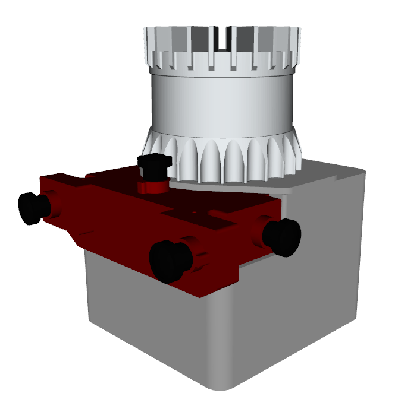

# halo_description
Robot Model definition of the HALO (Handheld Alphasense Lidar Ouster)

## Dependencies
- `ouster_description` available here: https://github.com/ori-drs/ouster_example/tree/master/ouster_description
- `alphasense_description` available here: https://github.com/ori-drs/alphasense_description
